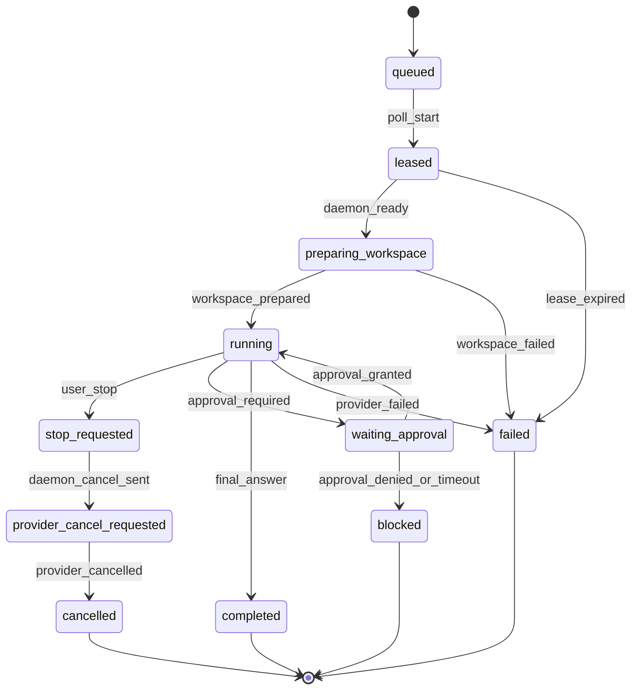

# Agent Execution Unresolved Design

> Riido task: RIID-4964 `에이전트 프로필을 업로드 하기 위한 endpoint 필요`
>
> This document analyzes the unresolved AI Agent execution issues from the
> daemon-side architecture point of view. It is intentionally structural: the
> goal is to fix the shared model first, then split implementation PRs across
> `riido-contracts`, `riido-control-plane`, `riido-daemon`, `riido-infra`, and
> client/desktop surfaces.

## 0. 결론

아래 미해결 항목들은 서로 다른 버그처럼 보이지만, 구조적으로는 같은 문제에서
나온다.

1. daemon 실행 단위가 `task_id` 중심이다. SaaS assignment 는 이미
   `assignment_id` 를 갖지만, runtime/supervisor/heartbeat/cancel watcher 는 여전히
   `task_id` 를 in-flight key 로 쓴다.
2. control-plane 의 assignment snapshot 이 "무엇을 어디에서 실행해야 하는가"를
   구조화해서 넘기지 못하고, repo/branch/task context 가 prompt 문자열 안에 묻혀
   있다.
3. stop, stream, retry, approval, resume 이 하나의 lifecycle/FSM 위에 있지 않고
   각 레이어의 부수 효과로 흩어져 있다.
4. provider 실행 환경이 "감지된 executable"까지만 고정되고, PATH/toolchain/env/cwd
   전체가 launch envelope 로 고정되지 않는다.

따라서 1차 설계 방향은 다음과 같다.

- `assignment_id` 기반 `ExecutionIdentity` 를 shared contract 로 승격한다.
- assignment snapshot 에 `WorkspacePlan` 과 최소 `RuntimeLaunchPolicy` 를 추가한다.
- daemon 은 `ExecutionIdentity` 로 in-flight/run/watcher/heartbeat 를 관리하고,
  `task_id` 는 UI grouping 과 read-model 조회용으로만 쓴다.
- stop/progress/final/retry/resume 을 generated FSM 과 event envelope 위로 올린다.
- private repo/auth/token 은 public contract 에 값으로 들어가지 않고, token reference
  또는 unsupported/fail-closed 상태만 공개 가능한 vocabulary 로 표현한다.

## 1. 현재 구조 증거

| 관찰 | 현재 코드 / SSOT | 구조적 의미 |
| --- | --- | --- |
| SaaS assignment id 는 metadata 로 보존하지만 `TaskRequest.ID` 는 `assignment.TaskID` 다. | `internal/agentbridge/controlplane/saasplane/saasplane.go` `taskRequestFromAssignment` | assignment 와 runtime run 이 1:1 key 로 고정되지 않는다. |
| `saasplane` state 는 `assignmentsByTask`, `runtimeIDsByTask`, `cancelWatchers`, `partialBodies` 를 모두 task id 로 저장한다. | `saasplane.go` `planeState`, `saveAssignmentRuntime`, `WatchCancellation`, `CompleteTask` | 같은 task 에 여러 active assignment 가 생기면 마지막 assignment 가 이전 watcher/runtime mapping 을 덮어쓴다. |
| supervisor `inFlight` map 과 duplicate guard 는 `req.ID` 기준이다. | `internal/agentbridge/supervisor/supervisor.go` `claimOne` | 같은 task 의 agent 교체/동시 assignment/retry attempt 가 독립 실행으로 모델링되지 않는다. |
| runtimeactor heartbeat 와 cancel surface 는 `RunningTaskIDs` / `Cancel(taskID)` 이다. | `internal/agentbridge/runtimeactor/runtimeactor.go` `Heartbeat`, `Cancel` | heartbeat 에서 server-side active assignment refresh 를 task id 로 역변환해야 한다. |
| workspace SSOT 는 per-run workdir, repo cache 분리, `run_id` 를 이미 정의한다. | `docs/20-domain/workspace.md` | 도메인 방향은 맞지만 SaaS assignment DTO 가 repo/workspace plan 을 구조화하지 않아 구현이 prompt 에 기대게 된다. |
| process spawn 은 child env override 만 받는다. override 가 없으면 parent env 를 상속한다. | `internal/process/processexec/processexec.go` `Start`, `mergeEnv` | provider detect 가 찾은 PATH/toolchain 환경이 launch 때 명시적으로 freeze 되지 않는다. |
| C7 security 는 approval decision vocabulary 를 갖고 있으나 headless web approval handoff 는 아직 runtime lifecycle 과 연결되지 않았다. | `docs/20-domain/security.md` §6 | "승인 필요"가 provider wait 상태인지, task needs-input 인지, fail-closed 인지 레이어마다 해석될 수 있다. |

## 2. 미해결 항목별 구조 원인

| ID | 증상 | 구조 원인 | 설계 방향 |
| --- | --- | --- | --- |
| F3 | AI 가 실제 코드가 아닌 빈 temp folder 에서 작업 | repo/branch 가 prompt text 이고 daemon 의 `WorkspacePlan` 이 아님 | control-plane 이 assignment snapshot 에 repo ref 를 구조화하고 daemon 이 public repo clone/worktree 를 materialize |
| C1 | stop 이 일관된 상태가 아님 | stop intent, process kill, projection terminal state 가 분리됨 | assignment lifecycle FSM 에 `stop_requested`, `provider_cancel_requested`, terminal states 추가 |
| S2/S4/S5 | server-side streaming cleanup 미완 | text delta/progress/final answer 가 같은 progress path 를 공유 | `StreamEnvelope` 를 `progress_event`, `answer_delta`, `final_answer` 로 분리 |
| F4/F5 | provider child tools 가 `git`/`node` 를 못 찾음 | detection executable 과 launch PATH/env 가 따로 움직임 | `RuntimeLaunchEnvelope` 에 executable, PATH, toolchain probe result, TTL 을 고정 |
| F6 | headless tool approvals blocked | approval policy 가 C7 decision 으로는 있으나 SaaS approval round-trip 이 없음 | safe auto-approve allowlist + web approval request/decision event 추가 |
| F7 | transient network error 재시도 없음 | saasplane HTTP transport 가 retry taxonomy 를 갖지 않음 | idempotent endpoint 별 retry/backoff wrapper 와 permanent/transient error type 분리 |
| R4 | daemon restart 후 처음부터 반복 | provider session id / run attempt / recovery policy 가 durable assignment 와 분리 | assignment run table 에 `provider_session_id`, `attempt`, `recovery_mode` 기록 |
| R5 | cancellation watcher leak | watcher 가 task id map 에 저장되고 terminal cleanup 에서 close 되지 않음 | `ExecutionIdentity` keyed watcher registry + terminal close/release invariant |
| D5/D7/F8 | desktop stop/orphan/stale lock/sync block | process identity, lock owner, sync preparation 이 runtime lifecycle 밖에 있음 | host lifecycle adapter 에 PID identity probe, lock lease, async prep state 추가 |
| R1 | provider process per task cold start | one-shot run 만 모델링되고 conversational session 과 resume 정책이 없음 | provider session table 과 long-lived process policy 를 분리 |
| Review | PID kill, cwd mismatch, multi-agent conflict, stale busy, SSE refetch dependency | runtime key, lifecycle, read-model update authority 가 레이어마다 다름 | assignment identity + FSM + client optimistic upsert + stale assignment reconciliation |

## 3. Target Domain Model

### 3.1 ExecutionIdentity

`ExecutionIdentity` 는 `riido-contracts` 로 승격해야 하는 shared vocabulary 다.
daemon 내부에서는 task id 대신 이 값을 실행 key 로 사용한다.

| Field | 의미 |
| --- | --- |
| `assignment_id` | SaaS assignment 의 primary execution id. in-flight, watcher, heartbeat, event report key |
| `task_id` | client/read-model grouping id. 여러 assignment 가 같은 task 를 가질 수 있음 |
| `component_id` | workspace/task thread projection scope |
| `agent_id` | assigned agent profile/runtime binding id |
| `runtime_id` | daemon runtime actor id |
| `run_id` | local workdir/IR run id. 기본값은 `assignment_id`; retry attempt 는 suffix 또는 attempt field 로 구분 |
| `attempt` | same assignment retry attempt number. process retry 와 user reassign 을 구분 |
| `provider_session_id` | provider native resume id. provider 가 보고한 뒤 durable event 로 저장 |

규칙:

1. daemon `inFlight`, runtimeactor session table, cancellation watcher,
   partial streaming buffer 는 `assignment_id` 또는 `run_id` 로 keying 한다.
2. heartbeat 는 `active_assignment_ids` 를 직접 보고한다. `running_task_ids` 는
   backward compatibility field 로만 남긴다.
3. `task_id` 로 runtime cancel 을 호출하는 path 는 compatibility adapter 에서만
   허용하고, 내부 actor 경계는 `execution_id` 를 사용한다.
4. user-facing task thread 는 task id 를 유지한다. terminal/active projection 은
   assignment lifecycle state 를 보고 결정한다.

### 3.2 WorkspacePlan

F3 를 해결하려면 "repo/branch 를 prompt 로 알려준다"가 아니라 "daemon 이 어디를
clone/materialize 해야 하는지"가 assignment snapshot 에 있어야 한다.

| Field | Phase | 설명 |
| --- | --- | --- |
| `source_kind` | P0 | `empty`, `git_public`, `git_private_unsupported`, `git_private_token_ref` |
| `repo_url` | P0 public only | public clone URL. private repo URL 은 public log/RAG 에 raw 로 남기지 않는다. |
| `repo_full_name` | P0 | 표시/진단용 stable id. private 이면 visibility 와 함께 최소화 |
| `branch_name` | P0 | Riido task branchName 또는 selected branch |
| `commit_sha` | P1 | 있으면 exact checkout. 없으면 branch head fetch |
| `visibility` | P0 | `public` / `private` / `unknown` |
| `auth_mode` | P0 | `none` / `unsupported` / `token_ref` |
| `auth_ref` | P2 private | token 값이 아니라 control-plane/daemon secret broker reference |
| `isolation_mode` | P0 | `git_worktree` / `shallow_clone` / `empty_explicit` |
| `required_surfaces` | P0 | scheduler 에 전달될 worktree/session/tool surface |

Phase P0 에서는 public repo 만 clone 한다. private repo 는 `git_private_unsupported`
로 fail-closed 하며, provider prompt 나 public event 에 token, signed URL, raw
credential 을 넣지 않는다.

### 3.3 RuntimeLaunchEnvelope

provider executable detection 은 runtime capability 의 일부이고, provider process
spawn 은 별도 launch envelope 이다. 둘을 분리하면 "감지는 됐지만 child tool 이
없다" 문제를 줄일 수 있다.

| Field | Owner | 설명 |
| --- | --- | --- |
| `selected_executable` | daemon C4 | adapter detect 가 고른 executable absolute path |
| `path` | daemon C4 | login-shell PATH + well-known install dirs + policy env 를 합친 frozen PATH |
| `env` | daemon C4/C7 | child process 에 명시적으로 넘기는 sanitized env |
| `cwd` | daemon C6 | prepared workdir |
| `toolchain_probe` | daemon C4 | `git`, `node`, package manager 등 provider child tool 가용성 |
| `detected_at` / `ttl` | daemon C4 | cached detection freshness |
| `approval_policy` | daemon C7 + contracts | auto-approve surface, approval-required surface, fail-closed surface |

`RuntimeLaunchEnvelope` 전체를 곧바로 contracts 로 올릴 필요는 없다. 다만
`selected_executable`, `provider_version`, `toolchain_probe`, `approval_policy_id`
처럼 control-plane/client 가 읽어야 하는 field 는 shared DTO 로 승격한다.

### 3.4 AssignmentLifecycleFSM

Stop/retry/resume 을 같은 의미로 다루려면 assignment lifecycle 은 generated FSM 으로
고정한다. 원천은 `riido-contracts` 의 Common Lisp DSL 이며, Go code 는 generated
SPI 로 소비한다.

FSM metadata must include:

- start states: `queued`, `leased`
- terminal states: `completed`, `cancelled`, `failed`, `blocked`
- retryable states: `leased`, `preparing_workspace`, transient transport failure
- non-retryable states: policy blocked, approval denied, private repo unsupported
- user-visible active states: `queued`, `leased`, `preparing_workspace`, `running`,
  `waiting_approval`, `stop_requested`, `provider_cancel_requested`

### 3.5 StreamEnvelope

Current partial-body forwarding is a pragmatic daemon-side bridge, but the
server should own user-facing stream semantics.

| Event kind | 저장 위치 | Client 의미 |
| --- | --- | --- |
| `progress_event` | assignment event log | status/progress row |
| `answer_delta` | stream buffer | assistant body live update |
| `final_answer` | terminal assignment result | completed thread body |
| `provider_log` | diagnostics/audit | hidden or expandable diagnostic |

Rule: `final_answer` 가 있으면 completed body 의 SSOT 이다. `answer_delta` 는
background correction / live render 용이며 terminal result 를 대체하지 않는다.

### 3.6 Retry and Recovery Policy

Retry 는 "다시 실행"이 아니라 "같은 assignment/run identity 에서 어떤 단계까지
회복 가능한가"의 문제다.

| Error class | Retry | 설명 |
| --- | --- | --- |
| `transport_transient` | yes | timeout, connection reset, 502/503/504. idempotent request 만 retry |
| `transport_permanent` | no | 400/401/403/404, contract violation |
| `workspace_prepare_transient` | maybe | network clone timeout, lock contention |
| `workspace_prepare_permanent` | no | private auth unsupported, branch not found |
| `provider_spawn_transient` | maybe | executable temporarily unavailable after TTL re-detect |
| `provider_policy_blocked` | no | C7 explicit deny |
| `provider_session_lost` | no blind rerun | resume id 가 없으면 `recovery_fresh_start_required` 로 노출 |

## 4. Repo Ownership

| Repo | 추가/변경해야 할 SSOT |
| --- | --- |
| `riido-contracts` | `ExecutionIdentity`, `WorkspacePlan`, assignment lifecycle FSM, stream envelope, approval request/decision DTO, generated enum/FSM SPI |
| `riido-control-plane` | task context 에서 `WorkspacePlan` 생성, assignment snapshot persistence, scoped reconcile, stream coalescer/final answer store, approval endpoint, assignment FSM transition guard |
| `riido-daemon` | assignment id keyed in-flight model, workspace materializer, launch envelope/PATH freeze, retry wrapper, watcher release, provider session resume policy |
| `riido-infra` | private auth broker/storage 가 필요할 때만 secret reference/IAM/Terraform. public docs 에 raw secret/evidence 금지 |
| client/desktop | optimistic thread cache upsert, SSE active stream subscription, daemon PID identity probe, stale lock recovery, update/quit handoff |

같은 vocabulary 가 두 repo 이상에서 필요하면 daemon 에 복사하지 않고
`riido-contracts` 승격을 먼저 검토한다.

## 5. Implementation Slices

### P0: Safety and identity foundation

1. daemon 내부에 `ExecutionIdentity` helper 를 추가한다.
2. `saasplane` maps/watchers/partial body 를 assignment id keyed 로 바꾼다.
3. supervisor/runtimeactor in-flight key 를 `execution_id` 로 바꾸고, `task_id` 는
   report metadata 로 보존한다.
4. terminal completion, heartbeat stale cancel, daemon shutdown 에서 watcher channel 을
   close/release 하는 invariant 를 추가한다.
5. `postJSON` / `getJSON` 에 transient retry/backoff 를 추가하되, event POST 는
   idempotency key 또는 operation id 가 없으면 retry 범위를 제한한다.
6. detect 결과의 selected executable 과 launch PATH 를 `TaskRequest.Env` 또는
   `StartRequest.Env` 로 명시 주입한다.

### P1: Public repo workspace materialization

1. `riido-contracts` 에 최소 `WorkspacePlan` DTO 를 추가한다.
2. control-plane assign/create-assignment handler 가 task context repo/branch 를 prompt
   문자열이 아니라 assignment snapshot field 로도 저장한다.
3. daemon `PrepareWorkspace` 전 단계에서 public git clone/worktree materializer 를
   호출한다.
4. private/unknown repo 는 `workspace_prepare_failed` +
   `git_private_unsupported` 로 fail-closed 한다.

### P1: Stop lifecycle normalization

1. assignment FSM 에 `stop_requested` 와 `provider_cancel_requested` 를 추가한다.
2. user stop 은 먼저 assignment state 를 바꾸고, daemon 은 cancellation poll/heartbeat
   response 로 process cancel 을 수행한다.
3. local daemon stop 은 `lifecycle.Context` 의 graceful/forced shutdown authority 를
   runtime/supervisor actor 경계까지 보존한다.
4. provider process kill 성공/실패와 assignment terminal projection 을 별도 event 로
   남긴다.

### P2: Streaming and approval plane

1. server 에 `answer_delta` coalescer 와 `final_answer` result path 를 추가한다.
2. daemon partial-body bridge 는 compatibility path 로 유지하되, stream envelope 가
   준비되면 server-owned stream path 로 전환한다.
3. approval request/decision DTO 를 contracts 로 승격한다.
4. safe auto-approve allowlist 를 먼저 적용하고, destructive/protected/network/secret
   surface 는 web approval 또는 fail-closed 로 둔다.

### P3: Resume and desktop lifecycle

1. provider 가 보고한 session id 를 durable assignment event 로 저장한다.
2. daemon restart 시 active assignment 를 무조건 처음부터 실행하지 않고
   `resume`, `recovery_fresh_start_required`, `failed_recovery` 중 하나로 수렴한다.
3. desktop/host adapter 에 process identity probe 를 추가해 stale PID kill 을 금지한다.
4. sync preparation 은 poll/heartbeat loop 를 막지 않도록 async state 로 분리한다.

## 6. Verification Plan

| Test | Repo | 증명 |
| --- | --- | --- |
| two assignments same task run independently | `riido-daemon` | same `task_id`, different `assignment_id` 가 in-flight/watcher/heartbeat 충돌 없이 동작 |
| watcher closes on terminal | `riido-daemon` | complete/cancel/stale heartbeat/shutdown 모두 goroutine leak 없음 |
| heartbeat reports assignment ids directly | `riido-daemon` + `riido-control-plane` | task id 역변환 없이 active assignment refresh |
| public repo materialization smoke | `riido-daemon` | public GitHub repo/branch 가 workdir 에 clone 되고 provider cwd 가 그 workdir |
| private repo fails closed | `riido-daemon` + `riido-control-plane` | token 없이 private repo 가 prompt/log/RAG 로 새지 않고 structured failure |
| launch PATH child tool smoke | `riido-daemon` | provider child process 가 `git`/`node` 를 찾는 PATH 를 받음 |
| transient retry fake server | `riido-daemon` | 503 후 retry success, 401/403 은 retry 없음 |
| stream envelope conformance | `riido-contracts` + `riido-control-plane` | progress/final/body projection 이 섞이지 않음 |
| FSM generated conformance | `riido-contracts` | Common Lisp source 에서 Go enum/SPI/Mermaid 가 생성되고 illegal transition 이 실패 |

## 7. Current Daemon Slice Status

2026-06-16 기준 daemon 에 반영된 P0 범위:

- `saasplane` runtime key 는 `assignment_id` 를 우선 실행 id 로 쓰고,
  logical `task_id` 는 metadata 로 보존한다.
- cancellation watcher, runtime id mapping, partial body buffer 는 execution id keyed 로
  정리되며 terminal completion path 에서 watcher 를 닫는다.
- supervisor 는 execution id 로 실행을 관리하되 workspace/IR 경로 계산에는 metadata 의
  logical task id 를 사용한다.
- SaaS JSON transport 는 safe/idempotent endpoint 만 transient retry/backoff 를 적용한다.
  event POST 는 idempotency key 가 도입되기 전까지 retry 하지 않는다.
- provider launch env 는 detectutil 의 frozen launch PATH 를 `StartRequest.Env` 와
  process spawn env 에 동일하게 주입한다.

아직 daemon 단독으로 완료했다고 볼 수 없는 범위:

- `ExecutionIdentity`, `WorkspacePlan`, stream envelope, lifecycle FSM 의 contracts 승격
- control-plane assignment snapshot/reconcile/stream projection 변경
- public repo materialization 과 private repo fail-closed evidence
- provider session resume / restart recovery policy

## 8. RAG / Public-Private Guardrails

이 문서는 public-safe architecture fact 만 담는다. RAG index 에 넣을 수 있는 것은
vocabulary, ownership, non-secret rules, generated contract shape, 테스트 기준이다.

RAG index 에 넣으면 안 되는 것:

- private repository clone URL with credential
- raw token, bearer token, PAT, GitHub App installation token
- AWS account-specific live evidence payload
- signed URL, temporary credential, SSM parameter value
- production smoke response body containing customer/task private content

private repo auth 가 필요해지면 public `WorkspacePlan` 은 `auth_mode=token_ref` 와
opaque `auth_ref` 만 갖고, 실제 token exchange/IAM/secret rotation evidence 는
private infra/runtime evidence store 에 둔다. public/private RAG index 는 물리적으로
분리한다.

## 9. Open Decisions

| ID | Decision needed | Default until decided |
| --- | --- | --- |
| Q-EXEC-001 | private repo auth 를 GitHub App installation token, user PAT broker, 또는 org-level deploy key 중 무엇으로 할 것인가 | public repo only, private fail-closed |
| Q-EXEC-002 | long-lived provider process 를 provider별 default 로 둘 것인가, conversational task 에만 opt-in 할 것인가 | one-shot default, resume id 있으면 explicit resume |
| Q-EXEC-003 | web approval timeout 과 fallback terminal state 는 무엇인가 | `blocked` with `approval_timeout` |
| Q-EXEC-004 | `WorkspacePlan` 을 assignment DTO 에 직접 넣을지, linked execution plan id 로 둘지 | assignment snapshot inline minimal plan |
| Q-EXEC-005 | stream delta retention 을 얼마나 유지할 것인가 | final answer durable, deltas bounded/ephemeral |

## 10. Non-goals

- 이 설계는 private repo auth 를 바로 구현하지 않는다.
- public daemon 은 provider CLI binary 를 번들하거나 설치하지 않는다.
- daemon 은 client read-model UI copy 를 소유하지 않는다.
- workspace materializer 는 사용자의 원본 repo working tree 를 직접 mutate 하지 않는다.
- public repository 에 live deployment payload 또는 secret evidence 를 저장하지 않는다.
