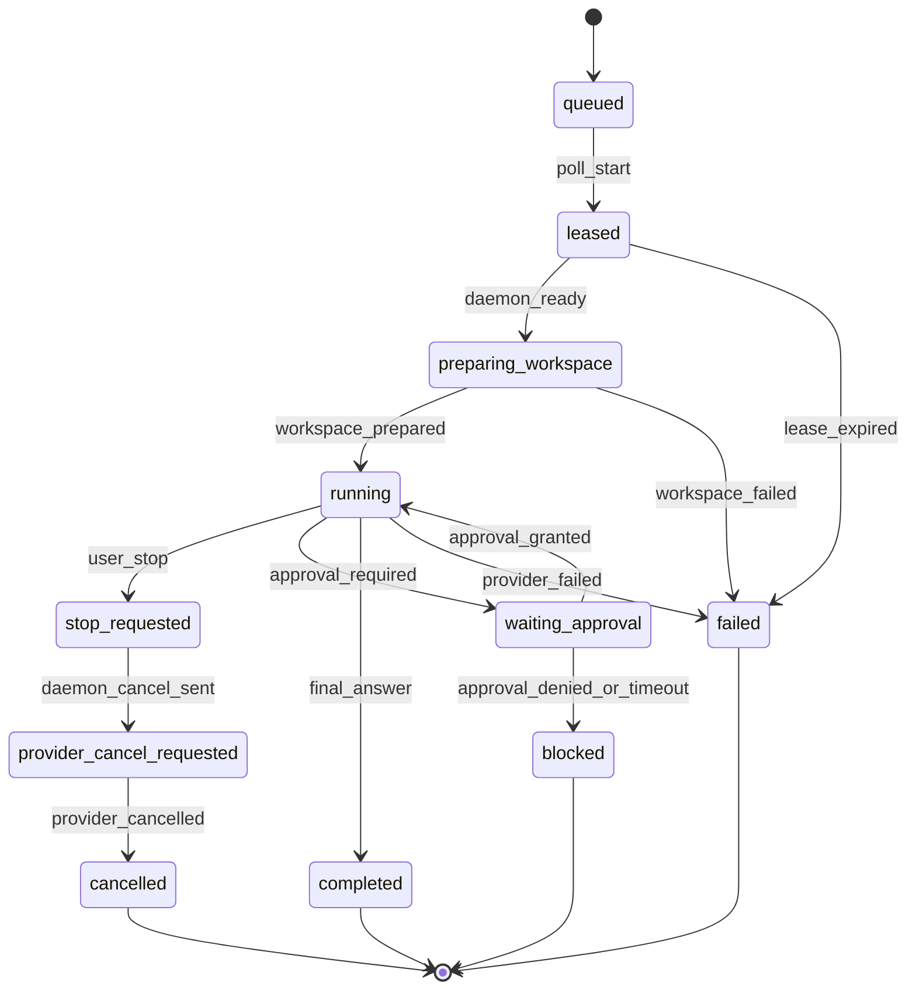

# Agent Execution Unresolved Design: Assignment Lifecycle FSM

[Back to agent-execution-unresolved-design.md](../agent-execution-unresolved-design.md)

### 3.4 AssignmentLifecycleFSM

Stop/retry/resume 을 같은 의미로 다루려면 assignment lifecycle 은 generated FSM 으로
고정한다. 원천은 `riido-contracts` 의 Common Lisp DSL 이며, Go code 는 generated
SPI 로 소비한다.

FSM metadata must include:

- start states: `queued`, `leased`
- terminal states: `completed`, `cancelled`, `failed`, `blocked`
- retryable states: `leased`, `preparing_workspace`, transient transport failure
- non-retryable states: policy blocked, approval denied, private repo unsupported
- user-visible active states: `queued`, `leased`, `preparing_workspace`, `running`,
  `waiting_approval`, `stop_requested`, `provider_cancel_requested`

### 3.5 StreamEnvelope

Current partial-body forwarding is a pragmatic daemon-side bridge, but the
server should own user-facing stream semantics.

| Event kind | 저장 위치 | Client 의미 |
| --- | --- | --- |
| `progress_event` | assignment event log | status/progress row |
| `answer_delta` | stream buffer | assistant body live update |
| `final_answer` | terminal assignment result | completed thread body |
| `provider_log` | diagnostics/audit | hidden or expandable diagnostic |

Rule: `final_answer` 가 있으면 completed body 의 SSOT 이다. `answer_delta` 는
background correction / live render 용이며 terminal result 를 대체하지 않는다.

### 3.6 Retry and Recovery Policy

Retry 는 "다시 실행"이 아니라 "같은 assignment/run identity 에서 어떤 단계까지
회복 가능한가"의 문제다.

| Error class | Retry | 설명 |
| --- | --- | --- |
| `transport_transient` | yes | timeout, connection reset, 502/503/504. idempotent request 만 retry |
| `transport_permanent` | no | 400/401/403/404, contract violation |
| `workspace_prepare_transient` | maybe | network clone timeout, lock contention |
| `workspace_prepare_permanent` | no | private auth unsupported, branch not found |
| `provider_spawn_transient` | maybe | executable temporarily unavailable after TTL re-detect |
| `provider_policy_blocked` | no | C7 explicit deny |
| `provider_session_lost` | no blind rerun | resume id 가 없으면 `recovery_fresh_start_required` 로 노출 |

## 4. Repo Ownership

| Repo | 추가/변경해야 할 SSOT |
| --- | --- |
| `riido-contracts` | `ExecutionIdentity`, `WorkspacePlan`, assignment lifecycle FSM, stream envelope, approval request/decision DTO, generated enum/FSM SPI |
| `riido-control-plane` | task context 에서 `WorkspacePlan` 생성, assignment snapshot persistence, scoped reconcile, stream coalescer/final answer store, approval endpoint, assignment FSM transition guard |
| `riido-daemon` | assignment id keyed in-flight model, workspace materializer, launch envelope/PATH freeze, retry wrapper, watcher release, provider session resume policy |
| `riido-infra` | private auth broker/storage 가 필요할 때만 secret reference/IAM/Terraform. public docs 에 raw secret/evidence 금지 |
| client/desktop | optimistic thread cache upsert, SSE active stream subscription, daemon PID identity probe, stale lock recovery, update/quit handoff |

같은 vocabulary 가 두 repo 이상에서 필요하면 daemon 에 복사하지 않고
`riido-contracts` 승격을 먼저 검토한다.

## 5. Implementation Slices

### P0: Safety and identity foundation

1. daemon 내부에 `ExecutionIdentity` helper 를 추가한다.
2. `saasplane` maps/watchers/partial body 를 assignment id keyed 로 바꾼다.
3. supervisor/runtimeactor in-flight key 를 `execution_id` 로 바꾸고, `task_id` 는
   report metadata 로 보존한다.
4. terminal completion, heartbeat stale cancel, daemon shutdown 에서 watcher channel 을
   close/release 하는 invariant 를 추가한다.
5. `postJSON` / `getJSON` 에 transient retry/backoff 를 추가하되, event POST 는
   idempotency key 또는 operation id 가 없으면 retry 범위를 제한한다.
6. **Resolved:** detect 결과의 selected executable 과 launch PATH 는
   `StartRequest.Env` 와 process spawn env 에 동일하게 주입된다.

### P1: Public repo workspace materialization

1. `riido-contracts` 에 최소 `WorkspacePlan` DTO 를 추가한다.
2. control-plane assign/create-assignment handler 가 task context repo/branch 를 prompt
   문자열이 아니라 assignment snapshot field 로도 저장한다.
3. daemon `PrepareWorkspace` 전 단계에서 public git clone/worktree materializer 를
   호출한다.
4. private/unknown repo 는 `workspace_prepare_failed` +
   `git_private_unsupported` 로 fail-closed 한다.

### P1: Stop lifecycle normalization

1. assignment FSM 에 `stop_requested` 와 `provider_cancel_requested` 를 추가한다.
2. user stop 은 먼저 assignment state 를 바꾸고, daemon 은 cancellation poll/heartbeat
   response 로 process cancel 을 수행한다.
3. local daemon stop 은 `lifecycle.Context` 의 graceful/forced shutdown authority 를
   runtime/supervisor actor 경계까지 보존한다.
4. provider process kill 성공/실패와 assignment terminal projection 을 별도 event 로
   남긴다.

### P2: Streaming and approval plane

1. server 에 `answer_delta` coalescer 와 `final_answer` result path 를 추가한다.
2. daemon partial-body bridge 는 compatibility path 로 유지하되, stream envelope 가
   준비되면 server-owned stream path 로 전환한다.
3. approval request/decision DTO 를 contracts 로 승격한다.
4. safe auto-approve allowlist 를 먼저 적용하고, destructive/protected/network/secret
   surface 는 web approval 또는 fail-closed 로 둔다.

### P3: Resume and desktop lifecycle

1. provider 가 보고한 session id 를 durable assignment event 로 저장한다.
2. daemon restart 시 active assignment 를 무조건 처음부터 실행하지 않고
   `resume`, `recovery_fresh_start_required`, `failed_recovery` 중 하나로 수렴한다.
3. **Resolved:** desktop/host PID fallback 은 identity sidecar 와 command-line probe
   없이는 kill 하지 않는다.
4. **Resolved:** Windows `.claim` lock 은 owner/refreshed_at metadata 를 쓰고 active
   holder 가 갱신하므로 오래된 orphan claim 만 회수한다.
5. sync preparation 은 poll/heartbeat loop 를 막지 않도록 async state 로 분리한다.

## 6. Verification Plan

| Test | Repo | 증명 |
| --- | --- | --- |
| two assignments same task run independently | `riido-daemon` | same `task_id`, different `assignment_id` 가 in-flight/watcher/heartbeat 충돌 없이 동작 |
| watcher closes on terminal | `riido-daemon` | complete/cancel/stale heartbeat/shutdown 모두 goroutine leak 없음 |
| heartbeat reports assignment ids directly | `riido-daemon` + `riido-control-plane` | task id 역변환 없이 active assignment refresh |
| public repo materialization smoke | `riido-daemon` | public GitHub repo/branch 가 workdir 에 clone 되고 provider cwd 가 그 workdir |
| private repo fails closed | `riido-daemon` + `riido-control-plane` | token 없이 private repo 가 prompt/log/RAG 로 새지 않고 structured failure |
| launch PATH child tool smoke | `riido-daemon` | provider child process 가 `git`/`node` 를 찾는 PATH 를 받음 |
| transient retry fake server | `riido-daemon` | 503 후 retry success, 401/403 은 retry 없음 |
| stale PID fallback refusal | `riido-daemon` | pid identity/socket/foreground command 증거 없이는 PID fallback kill 거부 |
| Windows stale claim recovery | `riido-daemon` | active claim refreshed_at 은 보존하고 오래된 claim 만 회수 가능 |
| stream envelope conformance | `riido-contracts` + `riido-control-plane` | progress/final/body projection 이 섞이지 않음 |
| FSM generated conformance | `riido-contracts` | Common Lisp source 에서 Go enum/SPI/Mermaid 가 생성되고 illegal transition 이 실패 |

## 7. Current Daemon Slice Status

2026-06-16 기준 daemon 에 반영된 P0 범위:

- `saasplane` runtime key 는 `assignment_id` 를 우선 실행 id 로 쓰고,
  logical `task_id` 는 metadata 로 보존한다.
- cancellation watcher, runtime id mapping, partial body buffer 는 execution id keyed 로
  정리되며 terminal completion path 에서 watcher 를 닫는다.
- supervisor 는 execution id 로 실행을 관리하되 workspace/IR 경로 계산에는 metadata 의
  logical task id 를 사용한다.
- SaaS JSON transport 는 safe/idempotent endpoint 만 transient retry/backoff 를 적용한다.
  event POST 는 idempotency key 가 도입되기 전까지 retry 하지 않는다.
- provider launch env 는 detectutil 의 frozen launch PATH 를 `StartRequest.Env` 와
  process spawn env 에 동일하게 주입한다.

아직 daemon 단독으로 완료했다고 볼 수 없는 범위:

- `ExecutionIdentity`, `WorkspacePlan`, stream envelope, lifecycle FSM 의 contracts 승격
- control-plane assignment snapshot/reconcile/stream projection 변경
- public repo materialization 과 private repo fail-closed evidence
- provider session resume / restart recovery policy
