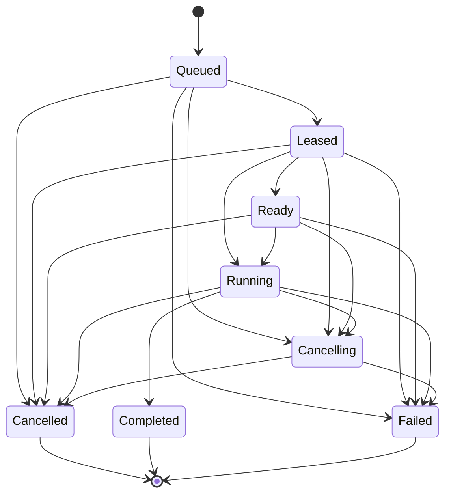

# Assignment Lifecycle FSM Evidence

<!-- Generated by go run ./tools/assignmentfsm -write-doc. Do not edit by hand. -->

[Back to agent-execution-unresolved-design.md](../agent-execution-unresolved-design.md)

Executable SSOT: [`assignment-lifecycle-fsm.riido.json`](assignment-lifecycle-fsm.riido.json).

Contract source: `github.com/teamswyg/riido-contracts/assignment`.

Evidence manifest: [`docs/30-architecture/agent-execution-unresolved-design/assignment-lifecycle-evidence.riido.json`](assignment-lifecycle-evidence.riido.json).

Generates the reader-facing assignment lifecycle diagram from the contracts generated FSM SPI instead of hand-maintained Mermaid.

## Generated Diagram

## FSM Metadata

- name: `assignment`
- type union: `AssignmentPollingFSM`
- states: `queued`, `leased`, `ready`, `running`, `cancelling`, `cancelled`, `completed`, `failed`
- start states: `queued`
- terminal states: `cancelled`, `completed`, `failed`
- user-visible active states: `leased`, `ready`, `running`
- transition count: `19`

## Related Sections

- [Stream envelope](stream-envelope.md)
- [Retry and recovery policy](retry-recovery-policy.md)
- [Repo ownership](repo-ownership.md)
- [Implementation slices](implementation-slices.md)
- [Verification evidence](verification-evidence.md)
- [Current daemon slice status](current-daemon-slice-status.md)
