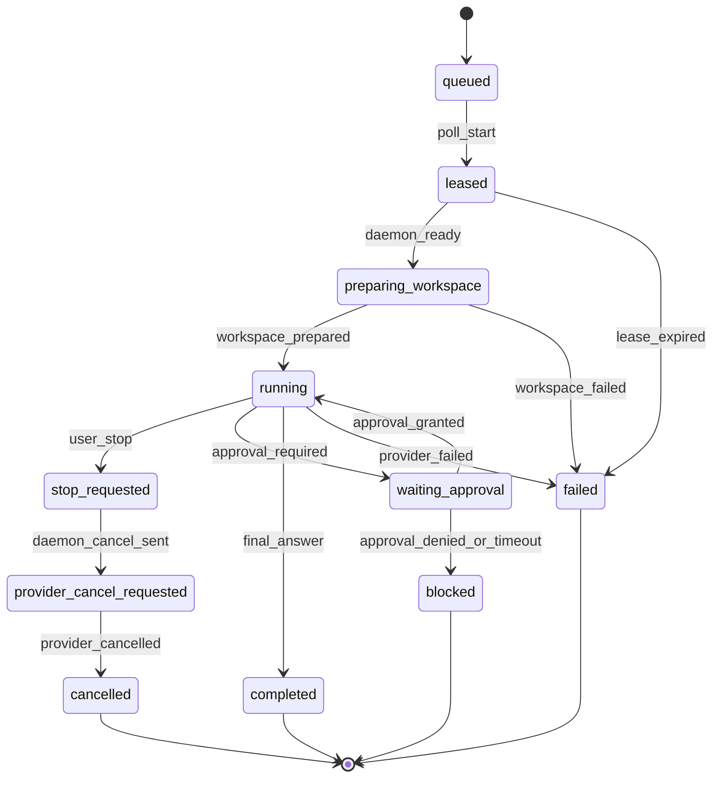

# Assignment Lifecycle FSM

[Back to agent-execution-unresolved-design.md](../agent-execution-unresolved-design.md)

Assignment lifecycle is generated from the `riido-contracts` Common Lisp FSM
source. Daemon consumes the generated Go enum/SPI and this page keeps the
reader-facing state diagram close to the executable evidence manifest.

FSM metadata:

- start states: `queued`, `leased`
- terminal states: `completed`, `cancelled`, `failed`, `blocked`
- retryable states: `leased`, `preparing_workspace`, transient transport failure
- non-retryable states: policy blocked, approval denied, private repo unsupported
- user-visible active states: `queued`, `leased`, `preparing_workspace`, `running`,
  `waiting_approval`, `stop_requested`, `provider_cancel_requested`

Executable evidence manifest:
[`assignment-lifecycle-evidence.riido.json`](assignment-lifecycle-evidence.riido.json).

Related sections:

- [Stream envelope](stream-envelope.md)
- [Retry and recovery policy](retry-recovery-policy.md)
- [Repo ownership](repo-ownership.md)
- [Implementation slices](implementation-slices.md)
- [Verification evidence](verification-evidence.md)
- [Current daemon slice status](current-daemon-slice-status.md)
